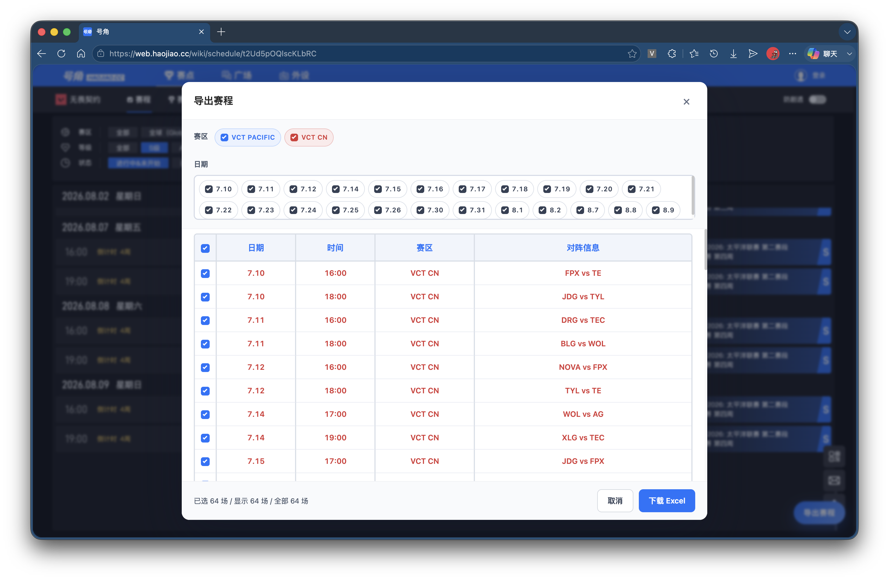
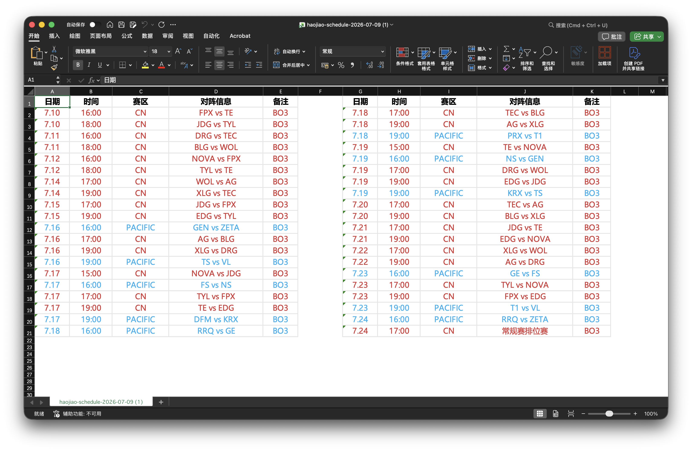

# VlrStreamingHelper

Valorant 直播辅助功能及赛程识别导出。适用于 Chrome/Edge，可辅助处理 Haojiao.cc、VLR.gg 的常用直播与赛事信息场景。

## 功能

- 屏蔽 Haojiao.cc 比赛页右侧聊天/评论区。
- 将 VLR.gg 页面中的某不正当地区旗帜替换为中国国旗。
- 从 Haojiao.cc 赛程页识别赛事、赛区和日期，并导出为双栏 Excel 赛程表。
- 弹窗里可分别开关辅助功能，并快速前往赛程导出。

## 预览

### 号角评论区开启

### 号角评论区屏蔽

### VLR 旗帜替换

### 赛程识别导出

### Excel 导出效果

## 安装

1. 打开 `chrome://extensions/` 或 `edge://extensions/`。
2. 开启“开发者模式”。
3. 点击“加载已解压的扩展程序”。
4. 选择 `VlrStreamingHelper` 文件夹。
