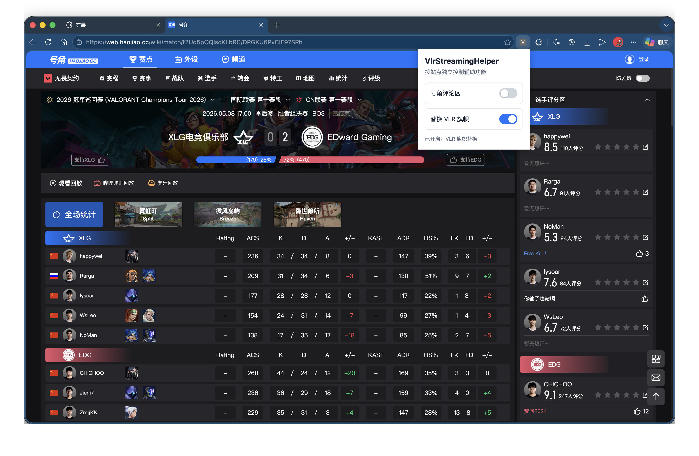
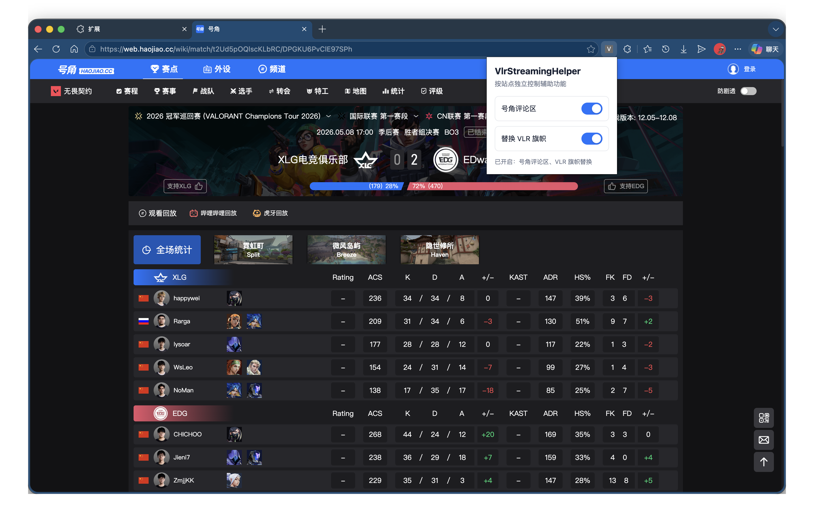
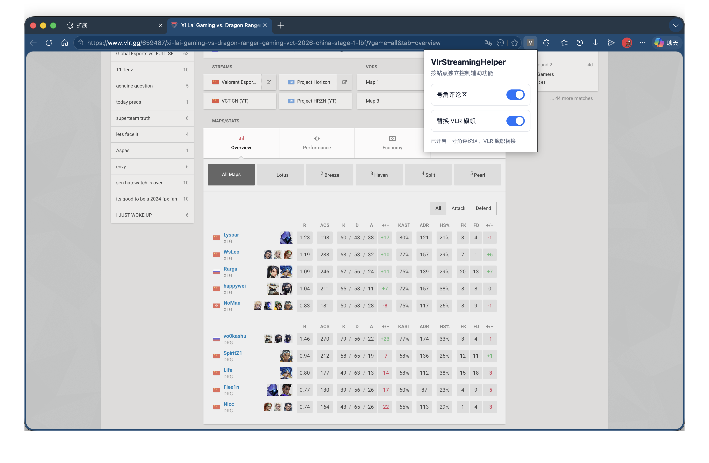

# VlrStreamingHelper

一个 Chrome/Edge 扩展，可以减少号角评论区对部分主播的打扰和 Vlr.gg 不正确的行为可能带来的影响。

## 功能

- 屏蔽 Haojiao.cc 比赛页右侧聊天/评论区。
- 将 VLR.gg 页面中的某不正当地区旗帜替换为中国国旗。
- 弹窗里可分别开关两个功能。

## 预览

### 号角评论区开启

### 号角评论区屏蔽

### VLR 旗帜替换

## 安装

1. 打开 `chrome://extensions/` 或 `edge://extensions/`。
2. 开启“开发者模式”。
3. 点击“加载已解压的扩展程序”。
4. 选择 `VlrStreamingHelper` 文件夹。
